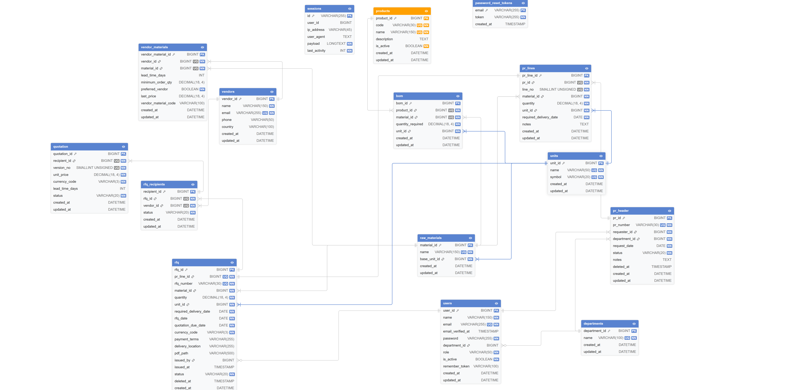

# Software Requirements Specification
## Procurement Process Digitalization MVP — ProcureFlow

| Field | Value |
|---|---|
| Document ID | SRS-MVP-001 |
| Version | 1.0 |
| Date | 2026-03-22 |
| Prepared By | Ghaith Hasan |
| Standard Basis | IEEE 830 / IEEE 29148 |

---

## 1. Introduction

### 1.1 Purpose
This SRS defines the functional and non-functional requirements for an MVP that digitalizes a manufacturing procurement workflow from **Purchase Request (PR)** creation through **Request for Quotation (RFQ)** drafting, vendor selection, RFQ issuance, and downloadable RFQ PDF output.

### 1.2 Scope

**In scope:**
- PR creation, editing (draft), submission, approval, and cancellation (from submitted state only).
- RFQ creation only from approved PR lines — one RFQ maximum per PR line.
- RFQ draft editing (dates, currency, terms, vendors), RFQ issue, RFQ cancel (draft only, admin).
- RFQ PDF download via DomPDF.
- Read-only master data views: products with BOM, raw materials, vendors with sourcing data.
- Role-based access control enforced at route, controller, and service layers.

**Deferred — schema-ready, not exposed as end-user workflow:**
- Recording vendor quotations in the UI (`quotation` table exists in schema).
- Award selection and audit fields.
- Automated outbound email with PDF attachment.

**Out of scope:**
- Purchase Order lifecycle.
- Inventory and accounting integration.
- Supplier portal and automated procurement optimization.

### 1.3 Definitions

| Term | Definition |
|---|---|
| PR | Internal Purchase Request for required raw materials |
| RFQ | Request for Quotation sent to one or more vendors |
| BOM | Bill of Materials — raw material requirements per finished product |
| MVP | Minimum Viable Product |
| UoM | Unit of Measure |
| Snapshot | Fields copied verbatim from PR line at RFQ creation — immutable after issue |

### 1.4 References
- Assignment 2: Procurement Process Digitalization MVP (AVERROA IT Launchpad).
- Repository: `README.md`, `Documentation/DATABASE.md`.
- IEEE 830 and IEEE 29148 guidance.

---

## 2. Overall Description

### 2.1 Business Domain
A manufacturing company purchases raw materials from international vendors. Master data — products, BOM, materials, vendors, currencies — supports planning and purchasing decisions. PR and RFQ documents provide traceability and control over spending.

**Core pain addressed:** the manual procurement cycle caused delays, no audit trail, repetitive effort, and avoidable operational risk. This MVP establishes the first layer of digital control.

### 2.2 Core Workflow

1. A **requester** creates a PR in **draft** with one or more lines (material, quantity, unit, required delivery date).
2. The requester **submits** the PR → status becomes **submitted**.
3. A **procurement manager** reviews the PR and either **approves** it → **approved**, or **cancels** it from submitted → **cancelled** (cancellation reason required).
4. A **purchasing officer** creates an RFQ **draft** from an approved PR line, selects currency and vendors, and sets RFQ date and quotation due date.
5. The purchasing officer **issues** the RFQ → status becomes **issued** (issuer and timestamp recorded).
6. Any authenticated stakeholder **downloads** the RFQ PDF. Email automation is not implemented.

### 2.3 User Roles

| Role | Code | Responsibilities |
|---|---|---|
| Requester | `requester` | Create, edit, and submit own PRs (draft only); view own PRs |
| Procurement Manager | `procurement_manager` | Approve or cancel submitted PRs; cannot approve own PR |
| Purchasing Officer | `purchasing_officer` | Create, edit, and issue RFQ drafts from approved PR lines |
| Admin | `admin` | All of the above; only role that can cancel a draft RFQ |

Master data pages are not role-restricted — any authenticated user may view them.

### 2.4 Operating Environment

| Component | Technology |
|---|---|
| Backend | Laravel 12, PHP 8.2+ |
| Database | MySQL |
| PDF Generation | barryvdh/laravel-dompdf |
| Frontend | Blade templates, Tailwind CSS, Alpine.js (Vite build) |
| Client | Modern web browser |

---

## 3. System Features

### 3.1 Purchase Request Management
- PR header: auto-generated number (`PR-YYYYMMDD-XXXX`), requester, department snapshot, request date, status, notes.
- PR lines: material, quantity, unit, required delivery date, line notes.
- Lifecycle: `draft → submitted → approved` or `submitted → cancelled`.
- Audit fields: `approved_by`, `approved_at`, `cancelled_by`, `cancelled_at`, `cancellation_reason`.
- Approved PRs cannot be cancelled in the current service layer.

### 3.2 RFQ Management
- Strictly one RFQ per PR line — enforced by database unique constraint and form validation.
- Snapshot fields copied from PR line at RFQ creation: `material_id`, `quantity`, `unit_id`, `required_delivery_date`. These fields are immutable once the RFQ is issued.
- RFQ header fields: `rfq_date`, `quotation_due_date`, `currency_id`, payment terms, delivery location.
- Recipients: multiple vendors per RFQ; duplicate vendor per RFQ prevented by unique key.
- Issue transition: `draft → issued`; records `issued_by` and `issued_at`.
- Cancel: **draft only**, **admin only**.

### 3.3 Vendor Quotation Management (Deferred)
- The `quotation` table supports `recipient_id`, `version_no`, `unit_price`, `lead_time_days`, `status`.
- No quotation create, edit, or view screens exist in the current application.
- Currency for quoted prices is not stored on `quotation`; commercial currency is defined on the parent RFQ via `currency_id`.

### 3.4 RFQ PDF Generation
- Any authenticated user downloads PDF via `GET /rfqs/{rfq}/pdf`.
- PDF content: RFQ number, PR reference, material snapshot, quantity, dates, recipients, commercial terms, vendor instructions.
- Generation is on-demand; `pdf_path` field is not required to persist.

### 3.5 Master Data (Read-Only Views)
- Products with BOM lines.
- Raw materials with base unit and vendor sourcing data (last price, currency, lead time, minimum order quantity).
- Vendors with vendor–material rows.
- No CRUD for master data in this MVP release.

### 3.6 Currency Management
- `currencies` table stores code (ISO 4217), name, and symbol.
- RFQ references one currency via `currency_id` — defines the required currency for all vendor responses.
- `vendor_materials.currency_id` records the currency of the last known price from that vendor.
- Quotation inherits currency from its parent RFQ; no separate currency column on `quotation`.

---

## 4. External Interface Requirements

### 4.1 User Interface
- PR list, create, edit, and show pages with actions gated by role and status.
- RFQ list, show, and edit pages; RFQ creation form embedded on the PR show page.
- RFQ PDF download action.
- Master data listing pages accessible to all authenticated users.

### 4.2 Software Interfaces

| Interface | Purpose |
|---|---|
| Laravel application | HTTP routes, controllers, form requests, services |
| MySQL | Persistence, foreign keys, check constraints, unique constraints |
| DomPDF | RFQ PDF rendering from Blade template |

### 4.3 Communication Interfaces
- HTTP/HTTPS only.
- Outbound email is not implemented; PDF is downloaded manually and attached by the user.

---

## 5. Functional Requirements

### 5.1 Implemented

| ID | Requirement | Verification |
|---|---|---|
| FR-PR-001 | The system shall assign a unique PR number at creation in the format `PR-YYYYMMDD-XXXX` (daily sequence, zero-padded to 4 digits). | Inspection / Test |
| FR-PR-002 | The system shall require at least one PR line and a valid request date before accepting PR submission. | Test |
| FR-PR-003 | The system shall reject PR lines with quantity ≤ 0. | Test |
| FR-PR-004 | The system shall reject PR lines where required delivery date is before today. | Test |
| FR-PR-005 | The system shall set PR initial status to **draft** at creation. | Inspection |
| FR-PR-006 | PR status transitions: `draft → submitted`, `submitted → approved`, `submitted → cancelled`. Approved PRs cannot be cancelled. | Test |
| FR-PR-007 | The system shall record `approved_by`, `approved_at`, `cancelled_by`, `cancelled_at`, and `cancellation_reason` on the PR header for audit purposes. | Inspection / Test |
| FR-PR-008 | A procurement manager shall not be permitted to approve a PR they created. | Test |
| FR-RFQ-001 | RFQ creation is allowed only for PR lines whose parent PR status is **approved**. | Test |
| FR-RFQ-002 | At most one RFQ row per PR line (`rfq.pr_line_id` unique). | Test |
| FR-RFQ-003 | RFQ shall snapshot `material_id`, `quantity`, `unit_id`, `required_delivery_date` from the PR line at creation. | Inspection |
| FR-RFQ-004 | The system shall assign a unique RFQ number in the format `RFQ-YYYYMMDD-XXXX`. | Inspection |
| FR-RFQ-005 | `quotation_due_date` shall be ≥ `rfq_date` (validated). | Test |
| FR-RFQ-006 | RFQ shall require a `currency_id` referencing the `currencies` table. | Test |
| FR-RFQ-007 | RFQ PDF shall include: RFQ number, PR reference, material, quantity, unit, RFQ date, quotation due date, currency, requester/department, vendor list, payment terms, delivery location, and vendor instructions. | Demonstration |
| FR-RFQ-008 | RFQ issue transition (`draft → issued`) shall be performed only by `purchasing_officer` or `admin`. | Test |
| FR-RFQ-009 | RFQ cancel shall be restricted to **draft** status and **admin** role only. | Test |
| FR-REC-001 | Multiple vendors may be added as recipients per RFQ. | Test |
| FR-REC-002 | A vendor may not be added twice to the same RFQ (unique `rfq_id`, `vendor_id`). | Test |
| FR-SEC-001 | Role middleware and controller-level checks shall enforce all PR and RFQ permission rules at the server side, independent of UI rendering. | Test |

---

## 6. Non-Functional Requirements

| ID | Requirement | Notes |
|---|---|---|
| NFR-SEC-001 | All business routes require authentication | Implemented via `auth` middleware |
| NFR-SEC-002 | Role-based authorization on all sensitive actions | Implemented via `role` middleware and `abort(403)` in controllers/services |
| NFR-SEC-003 | Passwords stored as hashes | Laravel default hashing (bcrypt) |
| NFR-DATA-001 | Referential integrity enforced at database level | Foreign keys and check constraints on all domain tables |
| NFR-AUD-001 | All transactional entities carry `created_at` and `updated_at` | Eloquent timestamps on all models |
| NFR-AUD-002 | PR approval and cancellation are traceable to the acting user and timestamp | `approved_by`, `approved_at`, `cancelled_by`, `cancelled_at` on `pr_header` |
| NFR-PERF-001 | Standard page load acceptable for LAN/intranet use | MVP target; not continuously measured |
| NFR-AVL-001 | Availability dependent on deployment environment | Outside MVP scope |

---

## 7. Data Model Overview

### 7.1 Core Entities

**Master data:**
`departments`, `users`, `currencies`, `units`, `products`, `raw_materials`, `bom`, `vendors`, `vendor_materials`

**Transactional:**
`pr_header`, `pr_lines`, `rfq`, `rfq_recipients`, `quotation` (UI deferred)

**Framework:**
`cache`, `sessions`, `jobs`, `password_reset_tokens` (Laravel defaults)

### 7.2 Key Relationships

- One **department** has many **users**.
- One **user** (requester) has many **PR headers**.
- One **PR header** has many **PR lines**.
- One **PR line** has zero or one **RFQ** (strict 1:1, enforced).
- One **RFQ** references one **currency** for all commercial terms.
- One **RFQ** has many **RFQ recipients** (one per vendor contacted).
- One **RFQ recipient** may have many **quotations** (schema only; UI deferred).
- One **vendor** has many **vendor materials**; each **vendor material** references a **currency** for `last_price`.

### 7.3 Key Design Decisions

- **Snapshot pattern:** RFQ copies demand fields from PR line at creation. Changes to PR line after RFQ creation do not affect the issued document.
- **Soft deletes:** applied to `pr_header` and `rfq` — business documents are never physically deleted.
- **Audit trail:** approval and cancellation actors and timestamps stored directly on `pr_header`.
- **Currency architecture:** defined once on `rfq`; `quotation` inherits it through the relationship chain, avoiding duplication.
- **Department snapshot:** PR header stores `department_id` at creation time — user department changes do not affect historical documents.

---

## 8. State Transitions

### 8.1 PR Lifecycle

| Current State | Next State | Actor |
|---|---|---|
| draft | submitted | Requester / Admin |
| submitted | approved | Procurement Manager / Admin (cannot be own PR) |
| submitted | cancelled | Procurement Manager / Admin (reason required) |
| approved | *(no transition implemented)* | — |
| cancelled | terminal | — |

### 8.2 RFQ Lifecycle

| Current State | Next State | Actor |
|---|---|---|
| draft | issued | Purchasing Officer / Admin |
| draft | cancelled | Admin only |
| issued | *(reserved: closed, awarded)* | Not implemented |
| cancelled | terminal | — |

Database enums include `closed` and `awarded` for forward compatibility. No application logic drives these transitions in the current release.

---

## 9. Assumptions and Constraints

- Master data is populated via seeders before any demo or testing session.
- All users have valid roles assigned in `users.role`.
- The MVP focuses on the PR → approval → RFQ draft → issue → PDF pipeline.
- Quotation capture and award are explicitly deferred though partially modeled in schema.
- Email automation is deferred to a future phase.

---

## 10. Traceability

| Business Objective | Supporting Requirements |
|---|---|
| BO-01 — Digitize PR creation and approval | FR-PR-001 to FR-PR-008, FR-SEC-001 |
| BO-02 — RFQ drafting, issuance, and PDF output | FR-RFQ-001 to FR-RFQ-009, FR-REC-001, FR-REC-002 |
| BO-03 — Vendor and currency management | FR-RFQ-006, master data views |
| BO-04 — Quotation and award | Deferred (FR-QTN-001, FR-AWD-001) |

**Verification legend:**
- **Test** — executable behaviour verified via browser or automated test.
- **Inspection** — code or schema review.
- **Demonstration** — stakeholder-visible output (e.g., PDF).

---

## 11. Appendix

### 11.1 Minimum RFQ PDF Content
RFQ number · PR reference · material name · quantity and unit · RFQ date · quotation due date · currency (code and symbol) · requester name and department · vendor list (name, country, email) · payment terms · delivery location · instructions for vendor.

### 11.2 Default Demo Accounts

| Role | Email | Password |
|---|---|---|
| Requester | ahmad@factory.com | password |
| Procurement Manager | sara@factory.com | password |
| Purchasing Officer | khalid@factory.com | password |
| Admin | admin@factory.com | password |

### 11.3 Entity-Relationship Diagram (ERD)

The figure below is the **Entity-Relationship Diagram (ERD)** for the procurement database as implemented in this MVP (master data, PR/RFQ documents, and related links). This diagram shows entities and their relationships at a glance.

